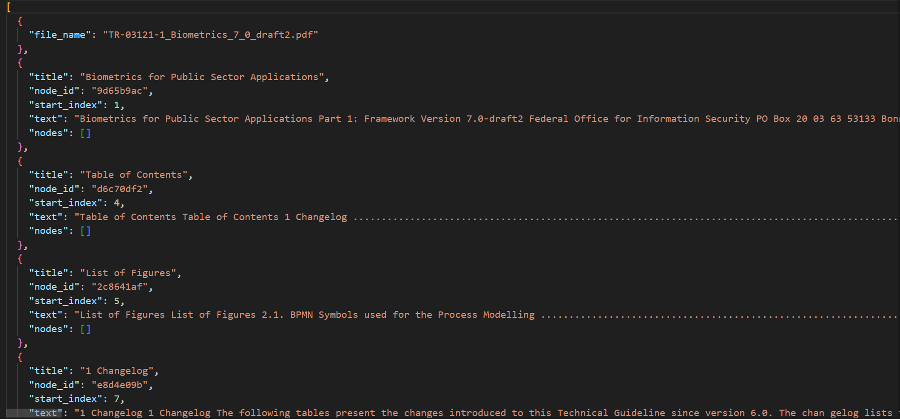

# Anleitung
Der Code basiert auf der Open-Source-Bibliothek PageIndex (siehe [pageindex/README.md](pageindex/README.md)).
In dieser App wird eine Gliederung(Outline) von PDFs erzeugt.

Das ausgewählte Modell ist Qwen/Qwen3-4B-Instruct-2507. (https://huggingface.co/Qwen/Qwen3-4B-Instruct-2507)

## Bespiele Ergebnisse



## Wie man das Programm ausführt?

### 1. Install dependencies

```bash
pip3 install --upgrade -r requirements.txt
```

### 2. Run App 

```bash
python main.py
```

